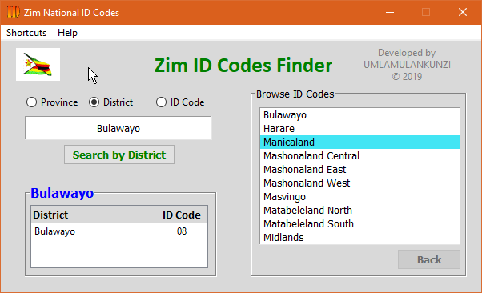

# Zim ID Codes

### Zimbabwe National ID District Codes App

A simple desktop GUI application built in **python3** using the **_tkinter_** library.

### Zimbabwe National ID Format
Zimbabwean person Identification Number is a 11 or 12 character alphanumeric number containing one 
alphabet character and the rest of the characters being numbers.
A valid ID Number is of the format;
1. Eleven character format.
    - **08- 123456 D 53**
2. Twelve character format.
    - **08- 1234567 D 53**

#### Decoding the Zim ID Number
| 08      | 123456   | D     | 53    |
| :---:   | :----:   |  :---:|:---:  |
| Code of the District where ID was applied and registered | incremental count of IDs issued in the particular District where ID was applied    | Check letter   | Code of the District of origin of the applicant, that is the District where the applicant comes from     |

    
### Main App Functionality
The application is for searching Zimbabwe National ID codes for all districts, provinces and towns.
This application was developed on windows OS and is yet to be tested on linux OS. 

### Requirements
- *Python3*
- *tkinter*
